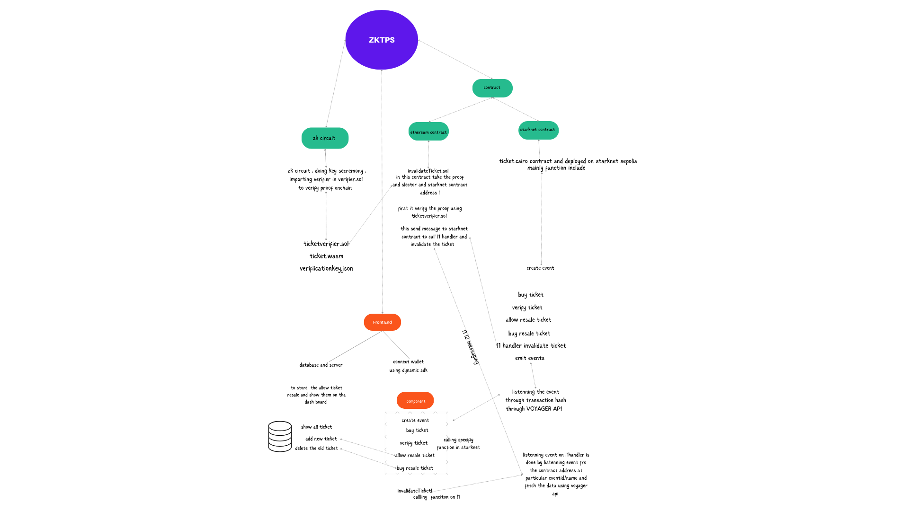

# Problem Statement:

- **High Costs:** Traditional ticketing platforms impose substantial fees, including service and processing fees, making it expensive for smaller organizers to host events.

- **Centralization:** Existing ticketing systems rely heavily on third-party platforms, leading to single points of failure, biased policies, and data breaches, reducing transparency and control for users.

- **Black Marketing:** Tickets often enter a secondary market where they are sold at inflated prices, disadvantaging genuine fans and enabling unfair profits for scalpers.

- **Replay Attacks:** Traditional ticketing systems are vulnerable to replay attacks, allowing malicious actors to reuse valid ticket transaction data for unauthorized access, compromising event security.

# Solution

- **Low Transaction Fees:** ZKTPS on StarkNet offers event organizers the ability to create events with minimal transaction fees, making hosting events more affordable.

- **Decentralization:** Being on the blockchain, ZKTPS eliminates centralization issues, ensuring transparency and preventing organizers from manipulating ticket availability.

- **Reselling Tickets:** The protocol includes a feature for ticket resale without users setting their prices, ensuring fair pricing and preventing black marketing.

- **Ticket Validation:** ZKTPS uses zero-knowledge proofs (zk-SNARKs) to invalidate tickets upon successful entry to an event, preventing ticket sharing and unauthorized reuse.

- **Versatile Usage:** ZKTPS allows tickets to be used both online and offline, including printing them on paper, providing flexibility and convenience for attendees.

- **Zero knowledge proofs:** Enabling zk snarks proofs on starknet by using L1-L2 messaging.

# Workflow



# Features

- **Event Creation:** Easily create and manage events with minimal transaction fees, empowering organizers to host events efficiently.

- **Joining Events:** Attendees can join events using an event ID or a shareable link provided by organizers, ensuring seamless access.

- **Ticket Scanning for Validity:** Enable event staff to scan tickets to verify their current validity, preventing unauthorized access.

- **Ticket Invalidation:** Utilize ticket scanning to invalidate tickets upon successful entry, ensuring each ticket is used only once.

- **Ticket Resale:** Enable ticket resale without users setting their prices, maintaining fair pricing and preventing black marketing.

- **Resaleable Tickets Dashboard:** A dedicated dashboard for users to view and buy tickets available for resale, enhancing user control and convenience.

- **Custom Token Integration:** Event organizers can integrate their custom tokens for ticket purchases, enhancing their community engagement.

# Why Use Zk-Snarks?

- **Credential Protection:** In a traditional hash system, real credentials would need to be provided on-chain, increasing the risk of exposure, especially in scenarios like ticket resale. zk-SNARKs allow for the verification of credentials without revealing them, enhancing security.

- **Proof Integrity:** zk-SNARKs enable the verification that the proof creator is the caller of the function on-chain. This prevents proof copying and unauthorized use, ensuring that only the rightful owner of the credentials can create a valid proof

# Tech Stack

- **Cairo:** Used for developing L2 contracts on StarkNet.
- **Solidity:** Utilized for creating L1 verifier contracts.
- **Circom:** Employed for constructing zk-SNARK circuits.
- **Starknet.js:** Facilitates interaction with contracts and functions on the client side.
- **snarkjs:** Generates zk-SNARK proofs on the client side.
- **React.js:** Powers the frontend of the application.
- **Argent Wallet:** Preferred browser wallet for user interactions.
- **Voyager API:** Used for event listening and managing L1-L2 transaction events, especially when no transaction hash is available.
- **Dynamic API:** Manages wallet connections with the dApp efficiently.
- **Express.js and MongoDB:** Backend technologies for storing resaleable tickets and fetching them for dashboard listing.

# Current Problem

One of the current challenges is the lack of an option for creating verifier contracts on StarkNet. This limitation necessitates the use of L1-L2 messaging, which requires interaction with Layer 1.

# Future Updates

- **Account Abstraction Integration:** Implementing account abstraction to facilitate zero transaction fees for users, with event organizers covering the costs using a paymaster.

- **Enhanced UI:** Developing a more user-friendly and visually appealing interface for a better user experience.

- **Elimination of L1 Interaction:** Removing the need for L1 interaction once verifier contracts for zk-SNARKs are available on StarkNet.

- **Contract ABI Verification.**

# How To Use


# Highlight Points

- **Fair Ticket Resale:** A built-in ticket resale system that prevents black marketing by setting fair resale prices automatically.

- **Secure Validation:** Zero-knowledge proofs (zk-SNARKs) ensure ticket validation without revealing credentials, preventing ticket reuse and unauthorized access.

- **Custom Token Integration:** Allows event organizers to use custom tokens for ticket purchases, boosting their token publicity and community engagement.

- **Voyager API Integration:** Prevents the need for custom delays after transactions by providing real-time data after event listening. Voyager ensures accurate event emission on the success of transactions in L2, even when L1-L2 messaging lacks L2 transaction hashes. which is used in components such as invalidateTicket, createEvent, buyTicket.

```
try {
      const transaction = await Invalidate(
        contract,
        Proof,
        toHex(nullifierHash),
        toHex(commitmentHash),
        recipient,
        selector
      );
      await transaction.wait();
      toast.success("invalidate Successful from l1");
      try {
        fetchDataContract(toHex(commitmentHash)); // fetches event from L2 contract.
      } catch (error) {
        console.log(`error in the fetching api ${error}`);
      }
    } catch (error) {
      alert(error);
    }
```

- **Reference of usage:**

```
https://github.com/PavitraAgarwal21/ZKTPS/blob/7a69a4af580ad0d290fc5808c8e37c691d58aa39/frontend/src/components/invalidateTicket.js#L185
```

- **Dynamic API Efficiency:** Enhances wallet connections by offering seamless and efficient methods for interacting with StarkNet.

```
<DynamicContextProvider
    settings={{
      environmentId: "Your environment Id"
      walletConnectors: [StarknetWalletConnectors],
      initialAuthenticationMode: "connect-only",
      events: {
        onAuthSuccess: () => {
          toast.success("connected");
        },
      },
    }}
  >
    <BrowserRouter>
      <App />
      <ToastContainer />
    </BrowserRouter>
</DynamicContextProvider>
```
